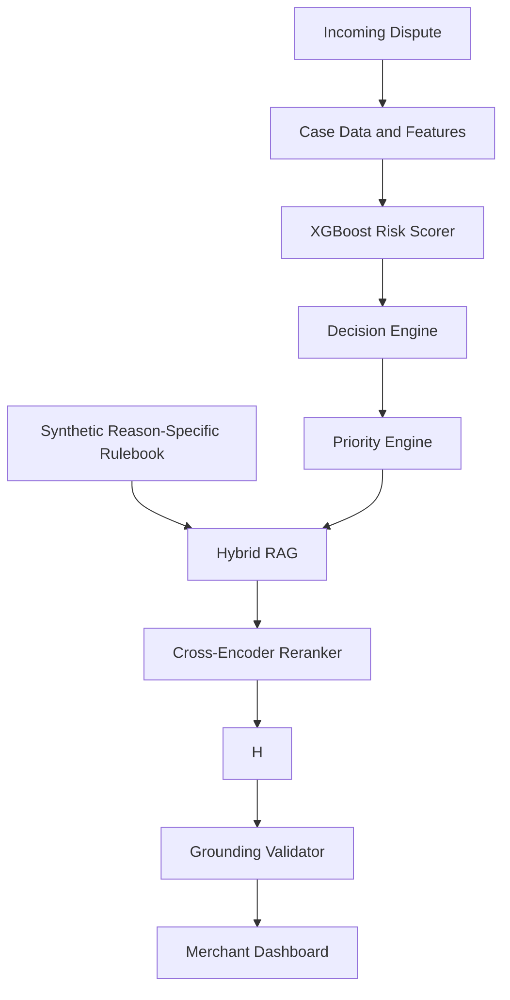
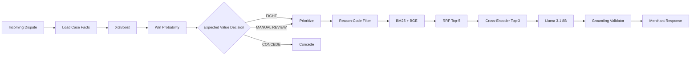
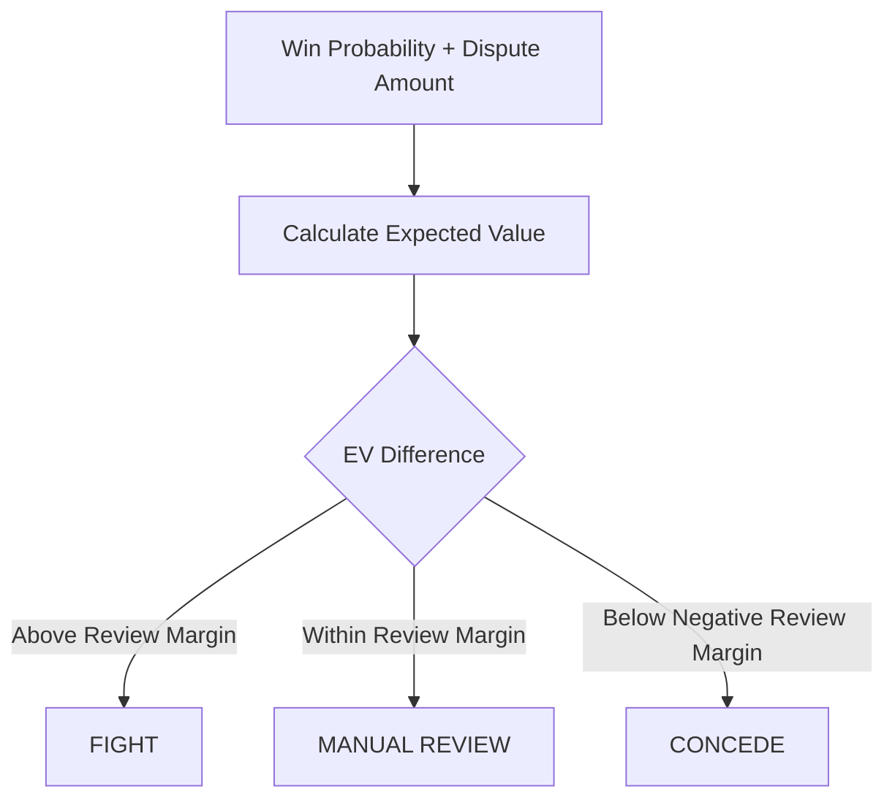
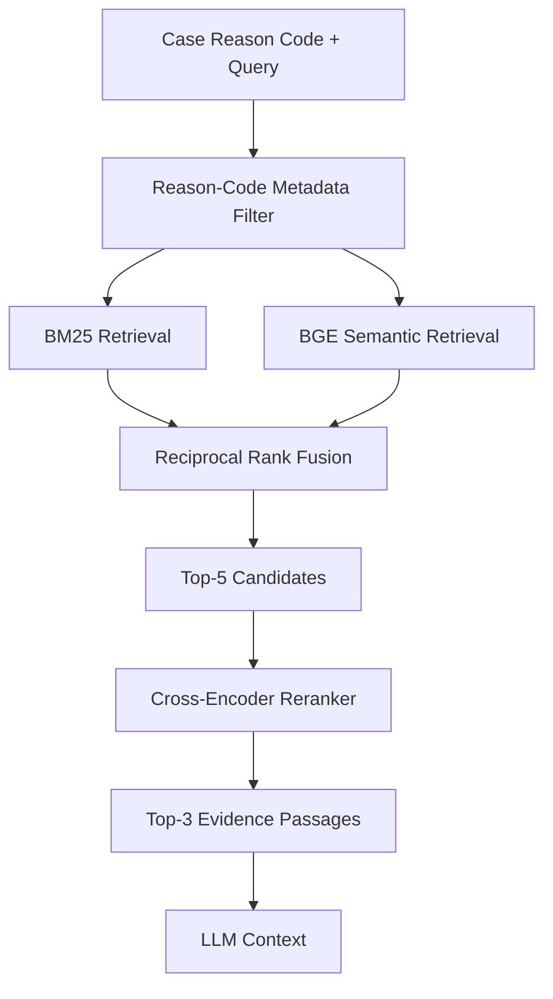
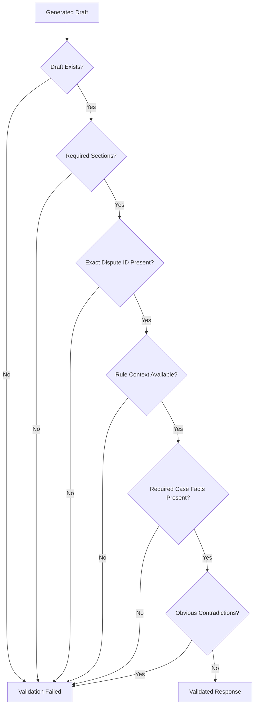
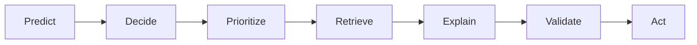

[README.md](https://github.com/user-attachments/files/31868343/README.md)
# AI Risk Manager — Chargeback Evidence Responder

An AI-powered chargeback risk-management system that helps merchants decide which disputes are worth fighting, prioritize operational workload, retrieve relevant evidence rules, generate grounded responses, and validate those responses before they reach the merchant.

Built for the **Razorpay AI Buildathon 2026 — AI Risk Manager** track.

---

## Table of Contents

- [Overview](#overview)
- [Problem Statement](#problem-statement)
- [Solution](#solution)
- [Key Capabilities](#key-capabilities)
- [System Architecture](#system-architecture)
- [End-to-End Workflow](#end-to-end-workflow)
- [Decision Engine](#decision-engine)
- [Priority Engine](#priority-engine)
- [Data and Evaluation Design](#data-and-evaluation-design)
- [Synthetic Rulebook and RAG](#synthetic-rulebook-and-rag)
- [LLM and Grounding](#llm-and-grounding)
- [Response Validation](#response-validation)
- [Machine Learning Model](#machine-learning-model)
- [Evaluation Results](#evaluation-results)
- [Economic Impact](#economic-impact)
- [Application Workflow](#application-workflow)
- [Live Dispute Simulation](#live-dispute-simulation)
- [Project Structure](#project-structure)
- [Technology Stack](#technology-stack)
- [Installation](#installation)
- [Configuration](#configuration)
- [Running the Application](#running-the-application)
- [Generating the Incoming Dispute Pool](#generating-the-incoming-dispute-pool)
- [Reproducibility and Leakage Controls](#reproducibility-and-leakage-controls)
- [Security and Privacy](#security-and-privacy)
- [Limitations](#limitations)
- [Future Improvements](#future-improvements)
- [Disclaimer](#disclaimer)

---

## Overview

Chargebacks create a recurring operational and financial problem for merchants. Each dispute may require the merchant to:

1. Determine whether the case is worth contesting.
2. Assess the strength of the available evidence.
3. Identify the evidence requirements applicable to the dispute reason.
4. Prepare a response within the available response window.
5. Balance potential recovery against the operational cost of fighting the dispute.

The **AI Risk Manager** addresses this workflow as an integrated decision-support system rather than as a standalone chatbot.

The system combines:

- Structured ML-based risk prediction
- Expected-value decisioning
- Financial and urgency-based prioritization
- Hybrid retrieval-augmented generation
- Cross-encoder reranking
- Grounded LLM generation
- Deterministic response validation
- A merchant-facing Streamlit dashboard

### Core workflow

> **Predict → Decide → Prioritize → Retrieve → Explain → Validate → Act**

---

## Problem Statement

A merchant cannot treat every dispute equally.

A low-value dispute with weak evidence may not justify the operational effort required to contest it. Conversely, a high-value dispute with strong supporting evidence may deserve immediate attention.

A useful system therefore needs to answer several questions together:

- How strong is this dispute from the merchant's perspective?
- Is fighting the dispute economically sensible?
- Which cases should be handled first?
- What evidence and rules apply to this specific reason code?
- Can an AI system draft the response without inventing evidence?
- Can the generated response be validated before it reaches the merchant?

---

## Solution

The system separates prediction, business logic, retrieval, generation, and validation into distinct components.



The LLM is intentionally not responsible for deciding whether a dispute should be fought. That decision is made before generation using deterministic business logic.

---

# Key Capabilities

## 1. Dispute Risk Scoring

An XGBoost classifier predicts the probability that the merchant will successfully contest a dispute.

The model uses structured case information including:

- Transaction amount
- Days from purchase to dispute
- Prior dispute count at the time
- Delivery confirmation
- OTP authentication confirmation
- Shipping/billing match
- Prior complaint status
- Dispute reason code
- Item category

---

## 2. Economic Decisioning

The predicted probability is combined with the disputed amount and a configurable fighting cost.

The system produces one of three actions:

- `FIGHT`
- `MANUAL_REVIEW`
- `CONCEDE`

This separates **model prediction** from **business action**.

---

## 3. Operational Prioritization

Priority is intentionally separate from win probability.

The queue prioritizes cases using:

- Financial exposure
- Response urgency

The current prototype uses:

```text
Priority = 0.6 × normalized amount
         + 0.4 × urgency
```

This allows a high-value case approaching its response deadline to move upward in the queue even when its predicted win probability is not the highest.

---

## 4. Hybrid Evidence Retrieval

For each supported dispute reason, the system retrieves relevant sections from a synthetic rulebook using:

- BM25 lexical retrieval
- BGE semantic embeddings
- Reciprocal Rank Fusion (RRF)
- Cross-encoder reranking

The retrieval pipeline narrows the candidate passages before generation.

---

## 5. Grounded Response Generation

The LLM receives:

- Case facts
- Retrieved rule context
- The system's decision
- The supplied win probability

It is explicitly instructed not to invent missing evidence or introduce unsupported causal relationships.

---

## 6. Response Validation

Before a response reaches the merchant, the validator checks for required structure and basic grounding conditions.

Only a validated response is surfaced to the merchant.

---

# End-to-End Workflow



### Runtime sequence

```text
Dispute
  ↓
Case Facts
  ↓
ML Score
  ↓
Decision
  ↓
Priority
  ↓
Reason-Specific Retrieval
  ↓
Reranking
  ↓
LLM Generation
  ↓
Validation
  ↓
Merchant Response
```

---

# Decision Engine

The decision engine uses expected value rather than treating the ML probability as the final business decision.

Current prototype parameters:

```text
FIGHT_COST_FLAT = ₹300
REVIEW_MARGIN   = ₹150
```

For a dispute with amount `A` and predicted win probability `P`:

```text
Expected value of fighting = P × A − fighting cost
Expected value of conceding = 0
```

The difference between these expected values is compared against the review margin.



The review margin is a prototype safety tolerance, not an industry benchmark.

---

# Priority Engine

The priority engine is designed for operational triage rather than prediction.

```text
Amount component = normalized dispute amount

Urgency component =
1 − clipped(days_left / response_window, 0, 1)

Priority =
0.6 × amount component
+
0.4 × urgency component
```

The prototype uses a configurable response-window proxy of **20 days**.

Priority therefore represents **financial exposure plus urgency**, rather than likelihood of winning.

---

# Data and Evaluation Design

## Synthetic Dispute Corpus

Real merchant and customer dispute data is not available to this project. Therefore, the project uses a synthetic dataset designed for reproducible development and evaluation.

The final corpus contains:

- **20,000 synthetic orders**
- **15,000 synthetic dispute cases**
- **6,000 synthetic customers**
- Four primary dispute reason codes
- A small set of `other_unclassified` edge cases

### Supported reason codes

```text
not_as_described
item_not_received
unauthorized_transaction
duplicate_charge
```

The synthetic corpus includes heterogeneous:

- Transaction amounts
- Purchase/dispute timing
- Customer history
- Authentication signals
- Delivery signals
- Complaint history
- Item categories
- Dispute outcomes

### Important distinction

The dataset is a **synthetic dispute-case corpus** used for system evaluation.

It is **not** intended to represent a real-world chargeback incidence rate.

---

# Train / Validation / Test Split

The ML evaluation excludes the unknown `other_unclassified` cases from supervised training/evaluation because there is intentionally no corresponding rulebook entry.

The remaining cases are split using stratification across:

- Reason code
- Outcome

Current split:

| Dataset | Cases |
|---|---:|
| Training | 10,489 |
| Validation | 2,248 |
| Held-out Test | 2,248 |
| Unknown / Excluded | 15 |

The held-out test set is used only for final reporting.

---

# Synthetic Rulebook and RAG

The rulebook is a synthetic, reason-code-specific policy layer.

It contains separate rule documents for the four supported dispute reasons.

The rulebook is:

- Semantically/section chunked
- Approximately 120 words per target chunk
- Created with exactly 20-word overlap
- Stored with metadata
- Indexed for hybrid retrieval

The final rulebook contains **19 chunks** across the four supported reason codes.

## Retrieval Architecture



## Embedding Model

```text
BAAI/bge-small-en-v1.5
```

Embeddings are normalized and stored in a local Chroma collection.

## Reranker

```text
cross-encoder/ms-marco-TinyBERT-L-2-v2
```

The cross-encoder is used for ranking. Its scores are not interpreted as probabilities.

---

# Real-World Grounding

The evidence categories and general dispute workflow are informed by publicly available payment/dispute documentation.

However:

> **The rulebook itself is synthetic and is used solely for reproducible evaluation. It is not a reproduction of proprietary card-network, payment-provider, or legal rules.**

The application does not claim that the synthetic rulebook represents binding real-world dispute requirements.

---

# LLM and Grounding

The generation layer uses:

```text
meta-llama/Llama-3.1-8B-Instruct
```

The LLM acts as a communication and evidence-drafting layer, not as the business decision-maker.

## Grounding Principles

The generation prompt requires the model to:

- Use only CASE FACTS and RETRIEVED RULES
- Never invent missing evidence
- Clearly distinguish confirmed and missing evidence
- Use only the supplied dispute reason
- Report the supplied decision and win probability exactly
- Avoid unsupported causal or relational claims
- Avoid introducing external legal, card-network, payment-provider, or industry requirements
- Treat missing applicable rules as a manual-review condition

A key grounding rule is:

> **Do not infer causality or relationships that are not explicitly stated in CASE FACTS. Describe only what each fact directly establishes.**

---

# Generated Response Structure

The response uses fixed section headers:

```text
Decision Context
Evidence Summary
Applicable Rule
Evidence Supporting Contest
Evidence Gaps
Recommended Response
```

The exact dispute ID supplied in the case facts is included in the response.

The validator checks the generated output before it is shown to the merchant.

---

# Response Validation

The validator acts as a final deterministic safety layer.

The validation process checks:



The validator is not intended to prove that every generated sentence is legally or factually correct. It is a guardrail against obvious structural, grounding, and contradiction failures.

---

# Machine Learning Model

## Model

```text
XGBoost Classifier
```

Configuration:

```text
n_estimators      = 300
max_depth         = 4
learning_rate     = 0.05
subsample         = 0.8
colsample_bytree  = 0.8
eval_metric       = aucpr
random_state      = fixed seed
```

No feature scaling is required for the tree-based model.

## Features

### Numeric

```text
amount
days_to_dispute
prior_dispute_count_at_time
```

### Boolean

```text
delivery_confirmed
otp_auth_confirmed
shipping_billing_match
prior_complaint_on_file
```

### Categorical

```text
reason_code
item_category
```

### Label

```text
outcome_true
```

---

# Threshold Selection

The model's operating threshold is selected on the validation set using an explicit cost function rather than simply maximizing accuracy.

Selected threshold:

```text
0.232
```

The final held-out test set is not used for threshold selection.

This keeps the test set independent for final performance reporting.

---

# Evaluation Results

The final ML evaluation is performed on the held-out test set.

| Metric | Result |
|---|---:|
| ROC-AUC | 0.685 |
| PR-AUC | 0.646 |
| Accuracy | 0.568 |
| Class 0 Precision | 0.877 |
| Class 0 Recall | 0.170 |
| Class 1 Precision | 0.535 |
| Class 1 Recall | 0.976 |

### Confusion Matrix

```text
                Predicted
              0        1

Actual 0     193      944
Actual 1      27     1084
```

The model is deliberately presented as a **risk signal rather than a certainty**. The ROC-AUC and PR-AUC indicate moderate discrimination rather than perfect prediction.

---

# Economic Impact

The system evaluates decisions using an explicit operational fighting-cost assumption.

Current prototype assumption:

```text
Fight cost = ₹300 per dispute
```

On the held-out test set, the modeled total error cost is approximately:

```text
₹315,987
```

This combines:

- Fight-related operational cost
- Money left on the table from disputes not successfully contested

The ₹300 fighting cost is a **configurable prototype assumption**, not an industry benchmark.

---

# Final Decision Distribution

On the held-out test set, the current decision engine produced:

| Decision | Cases | Share |
|---|---:|---:|
| MANUAL_REVIEW | 863 | 38.4% |
| FIGHT | 821 | 36.5% |
| CONCEDE | 564 | 25.1% |

This demonstrates the intended operating principle: the system does not automatically recommend fighting every dispute.

---

# Application Workflow

The Streamlit application contains the following operational views.

## Overview

Provides a high-level view of:

- Dispute volume
- Current queue
- Operational status
- Live simulation state

## Priority Queue

Allows the merchant to:

- Filter disputes
- Review priority
- Inspect financial exposure
- Open individual cases

## Dispute Analysis

Runs the complete case pipeline:

```text
Case
 ↓
ML Score
 ↓
Decision
 ↓
Priority
 ↓
RAG
 ↓
Reranking
 ↓
LLM
 ↓
Validation
 ↓
Evidence Response
```

## Model Performance

Displays held-out model evaluation metrics.

## Economic Impact

Displays modeled decision costs and business-oriented outcomes.

## Manual Analysis

Allows a manually supplied case to pass through the same shared processing path.

---

# Live Dispute Simulation

The application includes a lightweight incoming-dispute simulation.

A pool of synthetic disputes is released in batches of **10** when the queue is refreshed.


Important properties:

- Live cases use the same XGBoost model as historical cases.
- Live cases use the same decision logic.
- Queue refresh does not call the LLM for every incoming case.
- Held-out evaluation metrics remain separate from live simulation activity.
- The simulation does not represent real payment-provider webhooks.

---

# Project Structure

The current repository intentionally remains close to the working development structure to minimize runtime path changes.

```text
AI_Chargeback_Evidence_Responder/
│
├── app.py
├── pipeline.py
├── generator.py
├── validator.py
├── retriever.py
├── generate_incoming_pool.py
├── requirements.txt
├── README.md
├── .gitignore
│
├── data/
│   ├── orders.csv
│   ├── disputes.csv
│   ├── golden_answers.csv
│   └── incoming_disputes.csv
│
├── models/
│   ├── xgb_scorer.joblib
│   └── feature_columns.json
│
├── rulebook/
│   ├── RULE_NOT_AS_DESCRIBED.txt
│   ├── RULE_ITEM_NOT_RECEIVED.txt
│   ├── RULE_UNAUTHORIZED_TRANSACTION.txt
│   └── RULE_DUPLICATE_CHARGE.txt
│
└── chroma_db/
```

Runtime state such as the live simulation state is excluded from version control.

---

# Technology Stack

| Layer | Technology |
|---|---|
| Language | Python |
| ML | XGBoost, scikit-learn |
| Data Processing | pandas, NumPy |
| Vector Store | Chroma |
| Semantic Retrieval | BAAI/bge-small-en-v1.5 |
| Lexical Retrieval | BM25 |
| Reranking | ms-marco-TinyBERT-L-2-v2 |
| LLM | Llama 3.1 8B Instruct |
| LLM Inference | Hugging Face Inference |
| UI | Streamlit |
| Model Persistence | joblib |
| Environment Configuration | python-dotenv |

---

# Installation

## 1. Clone the Repository

```bash
git clone https://github.com/Gautam0211/Razorpay_AI_Chargeback_Evidence_Responder.git
cd Razorpay_AI_Chargeback_Evidence_Responder
```

## 2. Create a Virtual Environment

### Windows PowerShell

```powershell
python -m venv .venv
.venv\Scripts\Activate.ps1
```

### Linux / macOS

```bash
python -m venv .venv
source .venv/bin/activate
```

## 3. Install Dependencies

```bash
pip install -r requirements.txt
```

---

# Configuration

Create a `.env` file in the project root:

```env
HF_TOKEN=your_huggingface_token
```

The token is used for LLM inference.

Do not commit `.env` or any API credentials to Git.

The repository `.gitignore` excludes environment secrets.

---

# Running the Application

Start the Streamlit application:

```bash
streamlit run app.py
```

The terminal will display the local Streamlit URL.

Open that URL in a browser to access the dashboard.

---

# Generating the Incoming Dispute Pool

The live simulation uses:

```text
data/incoming_disputes.csv
```

The generator is located in the project root.

Run:

```bash
python generate_incoming_pool.py
```

This creates:

```text
data/incoming_disputes.csv
```

The application releases cases from this pool in batches of 10.

---

# Reproducibility and Leakage Controls

The project separates model development, model selection, and final evaluation.

## Held-out test set

The test set is not used for:

- Model training
- Threshold selection
- Final decision-margin selection

The threshold is selected using validation data.

## Golden Answers

`golden_answers.csv` acts as an offline evaluation/answer key.

It contains information used to evaluate synthetic outcomes and retrieval expectations.

These fields are not exposed to the runtime LLM or decision logic as case evidence.

## Unknown Reason-Code Cases

`other_unclassified` cases are intentionally excluded from supervised model training/evaluation because there is no corresponding rulebook entry.

This provides an explicit edge case for fallback behavior rather than silently fabricating a rule.

---

# Security and Privacy

The project is designed around synthetic data for the hackathon.

No real customer payment credentials, card numbers, authentication secrets, or production merchant dispute records are required by the evaluation workflow.

Security principles include:

- API credentials stored in environment variables
- `.env` excluded from version control
- No production customer data in the synthetic evaluation corpus
- LLM restricted to supplied case facts and retrieved rules
- Generated responses validated before presentation
- Unknown or missing rule contexts treated as fallback conditions rather than invented evidence

For a production deployment, additional controls would be required, including:

- Authentication and authorization
- Encryption in transit and at rest
- Secrets management
- Audit logging
- Data retention policies
- Role-based access control
- PII minimization
- Monitoring and alerting
- Provider-specific compliance controls

---

# Limitations

This is a hackathon prototype and should not be interpreted as a production chargeback adjudication system.

## 1. Synthetic Data

The ML evaluation uses synthetic disputes rather than proprietary merchant data.

## 2. Synthetic Rulebook

The evidence rules are created for reproducible evaluation and are not authoritative card-network or legal rules.

## 3. Moderate Model Discrimination

The reported ROC-AUC and PR-AUC indicate that the model should be treated as a risk signal, not a definitive predictor.

## 4. Response-Window Proxy

The current priority calculation uses a configurable 20-day response-window proxy.

## 5. Prototype Cost Assumptions

The ₹300 fighting cost is an explicit configurable assumption.

## 6. LLM Inference

Response generation depends on external LLM inference availability and latency.

## 7. Human-in-the-Loop

Manual review is represented as a decision outcome, but a complete human approval workflow is a future production enhancement.

## 8. Live Simulation

Incoming disputes are simulated rather than received from production payment-provider webhooks.

---

# Future Improvements

Potential production extensions include:

- Probability calibration
- Merchant-specific model training
- Cost-sensitive decision policies
- Human approval workflows for high-value disputes
- Production webhook ingestion
- Payment-provider API integration
- Real-time evidence collection
- Document-level provenance
- Automated audit trails
- Retrieval and generation observability
- Model drift monitoring
- Rulebook versioning
- PII-aware data handling
- Role-based access control
- Production-grade secrets management
- Graph-based workflow orchestration as workflow complexity increases

---

# Design Principles

## Separate Prediction from Action

The ML model estimates case strength. The deterministic decision engine decides what action makes economic sense.

## Separate Priority from Probability

A case can be operationally urgent because of financial exposure and response timing even when it is not the highest-probability case.

## Ground Generation

The LLM communicates supplied evidence rather than inventing evidence.

## Validate Before Presentation

Generated responses pass through deterministic checks before reaching the merchant.

## Be Transparent About Evaluation

Synthetic data, assumptions, limitations, and held-out metrics are explicitly disclosed.

---

# Architecture Summary



The system connects structured ML prediction with economic decisioning, operational prioritization, evidence retrieval, grounded response generation, and deterministic validation.

---

# Disclaimer

This project is a hackathon prototype created for the **Razorpay AI Buildathon 2026**.

The synthetic dataset, synthetic rulebook, cost assumptions, and response-window assumptions are intended for demonstration and reproducible evaluation.

The system does not provide legal advice, does not establish binding payment-network requirements, and should not be used as a production chargeback adjudication system without appropriate validation, compliance review, data governance, security controls, and human oversight.
